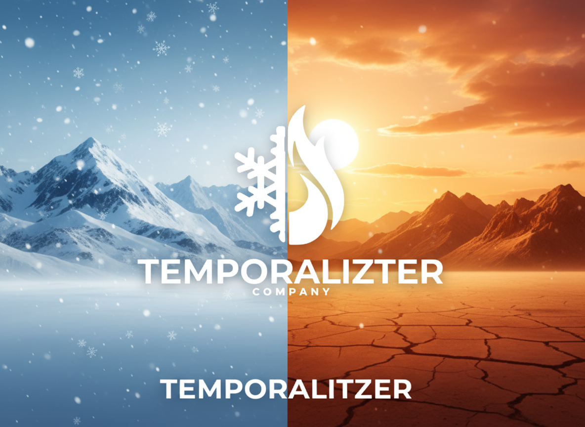

# 🌤️ Temporalitzer

**Temporalitzer** es una aplicación web desarrollada con **Python (Flask)** y **JavaScript** que muestra en tiempo real el **clima actual, la hora local y la información geográfica** de cualquier ciudad del mundo.  
Su objetivo es ofrecer una experiencia limpia, rápida y visualmente dinámica, combinando datos meteorológicos y temporales en una sola interfaz.

---

## 🚀 Tecnologías utilizadas

### 🧩 Backend
- **Flask** — Framework principal de Python.
- **Requests** — Para consumir APIs externas.
- **Flask-CORS** — Permite comunicación segura con el frontend.
- **OpenWeatherMap API** — Para obtener información meteorológica detallada.
- **IP-API** — Para detectar ubicación automática por IP.

### 💻 Frontend
- **HTML5 / CSS3 / JavaScript**
- **Axios** — Para realizar peticiones HTTP al servidor Flask.
- **SweetAlert2** — Para mostrar mensajes informativos personalizados.
- **Diseño responsivo y dinámico** según el clima y la hora del día.

---

## ⚙️ Funcionamiento

1. **Detección automática de ubicación:**  
   La app obtiene la ubicación del usuario mediante su IP (gracias a `ip-api.com`).

2. **Consulta de clima y hora:**  
   A partir de la ciudad detectada o introducida por el usuario:
   - Se consulta la **API de OpenWeatherMap** para obtener temperatura, humedad, viento, presión, descripción del cielo, etc. 

3. **Visualización dinámica:**  
   Dependiendo de la temperatura y las condiciones meteorológicas:
   - Cambia **iconos e imágenes de fondo** (día soleado, lluvia, nieve, niebla, etc.).
   - Ajusta los **colores del texto** y del entorno para mantener una buena legibilidad.

---
